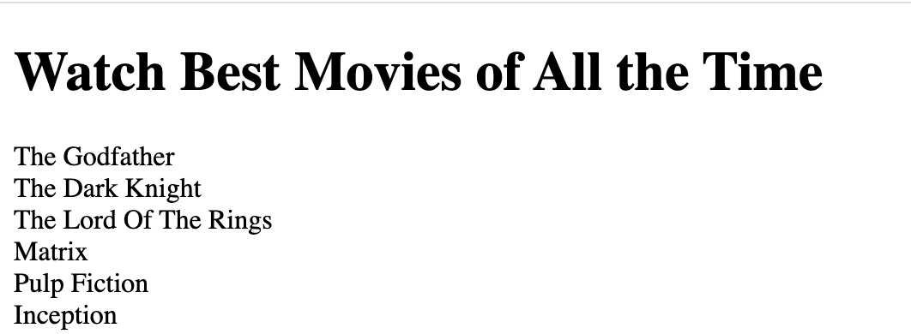
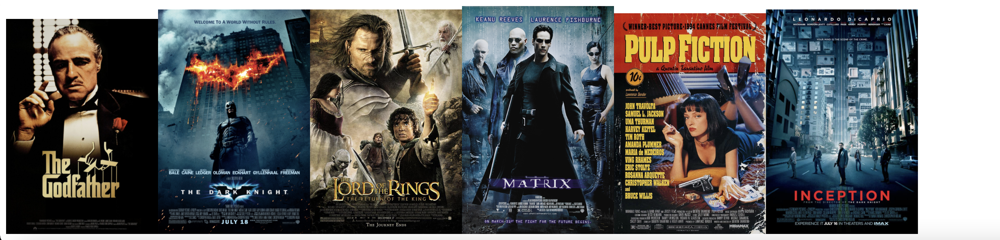
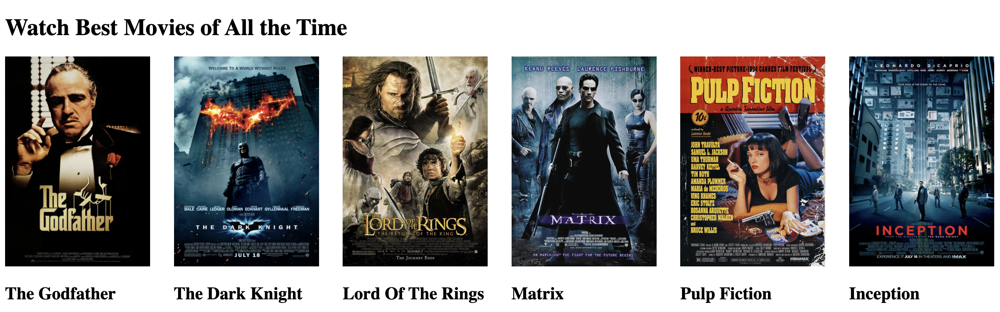

<!-- .slide: id="lesson14" -->

# Basic Frontend - Spring 2022

Lesson 14, Tuesday, 2022-05-05

---

### Recap: Arrays

What is an `array` ?

An `array` is a container type that holds multiple values:

<!-- .element: class="fragment" -->

```js
// we create an empty array using []
let emptyArray = [];

// we put the values we want in square brackets
// separated by commas
let ages = [19, 33, 25, 40];
let cities = ["London", "Paris", "Berlin"];
```

<!-- .element: class="fragment" -->

---

### Recap: Arrays

```js
let arr = [1, 2, 3, 4, 5];
console.log(arr.length, arr[3]); // what does this output?
```

`5 4`

<!-- .element: class="fragment" -->

---

### Recap: Arrays

Array can hold any type of value:

```js
let prices = [0.99, 1.49];
```

And any quantity:

```js
// I only have one favorite food
let favoriteFoods = ["Pizza"];
// An array holding 26 letters of the alphabet
let alphabet = ["a", "b", "c", "d", "e", "f", "g", "h", "i", "j", "k", "l"]; //TODO
```

---

### Loops to interact with an Array

```js
let cars = ["Saab", "Volvo", "BMW"];

for (let i = 0; i < cars.length; i++) {
  console.log(cars[i]);
}
```

---

### Recap: DOM

- DOM is an API
- It allows us to add/remove/change any element of a web page

---

<!-- .slide: id="create-element" -->

### Recap: document.createElement

Basic usage:

```js
let myDiv = document.createElement("div");
```

---

```js
let myDiv = document.createElement("div"); // 1
myDiv.textContent = "hello"; // 2
document.body.appendChild(myDiv); // 3
// <div>hello</div> has been added to the page!
```

1. Create a new HTML element using `document.createElement`. Pass the type of the element (`div`, `button`, `img`, ...) as string.
2. Set all the properties you like, e.g. `textContent`, `onclick`, ...
3. `appendChild` add an element to the end of the list of children of a specific parent element. Here, we append it to the document's `<body>`.

---

### document.createElement + Arrays

Let's see how to combine this two concepts.

We are ready to create HTML elements using data from an Array.

- Remember: Arrays could contain different types of data.

---

### Example:

Given an array of "Movie Titles" show the Titles in a wep page.



---

Let's create a new element with the first title in the array

```js
const movies = [
  "The Godfather",
  "The Dark Knight ",
  "The Lord Of The Rings",
  "Matrix",
  "Pulp Fiction",
  "Inception",
];

let myDiv = document.createElement("div");
myDiv.textContent = movies[i];
document.body.appendChild(myDiv);
```

---

### Quiz

How can we create the new elements for the rest of the titles in the `array` without repeating code?

Yes, using a loop to create an element for each of the titles in the array.

 <!-- .element: class="fragment" -->

---

```js
const movies = [
  "The Godfather",
  "The Dark Knight ",
  "The Lord Of The Rings",
  "Matrix",
  "Pulp Fiction",
  "Inception",
];

for (let i = 0; i < movies.length; i++) {
  let myDiv = document.createElement("p"); // 1
  myDiv.textContent = movies[i]; // 2
  document.body.appendChild(myDiv); // 3
}
```

---

### Exercise 1

Given an array of movie posters urls, create a web page that shows each poster.

You should use `createElement()` and `appendChild()` to the `document.body` to complete this task.

See the example below to create a new image element in the `document.body`

```js
let imageElement = document.createElement("img");
imageElement.src = `https://images.unsplash.com/photo-1596262842190-768d6bd1d819?ixlib=rb-1.2.1&ixid=MnwxMjA3fDB8MHxwaG90by1wYWdlfHx8fGVufDB8fHx8&auto=format&fit=crop&w=2752&q=80`;
imageElement.width = 200;
document.body.appendChild(imageElement);
```

---

### Array

```js
let moviePosters = [
  "https://m.media-amazon.com/images/M/MV5BM2MyNjYxNmUtYTAwNi00MTYxLWJmNWYtYzZlODY3ZTk3OTFlXkEyXkFqcGdeQXVyNzkwMjQ5NzM@._V1_.jpg",
  "https://m.media-amazon.com/images/M/MV5BMTMxNTMwODM0NF5BMl5BanBnXkFtZTcwODAyMTk2Mw@@._V1_.jpg",
  "https://m.media-amazon.com/images/M/MV5BNzA5ZDNlZWMtM2NhNS00NDJjLTk4NDItYTRmY2EwMWZlMTY3XkEyXkFqcGdeQXVyNzkwMjQ5NzM@._V1_FMjpg_UX800_.jpg",
  "https://m.media-amazon.com/images/M/MV5BNzQzOTk3OTAtNDQ0Zi00ZTVkLWI0MTEtMDllZjNkYzNjNTc4L2ltYWdlXkEyXkFqcGdeQXVyNjU0OTQ0OTY@._V1_.jpg",
  "https://m.media-amazon.com/images/M/MV5BNGNhMDIzZTUtNTBlZi00MTRlLWFjM2ItYzViMjE3YzI5MjljXkEyXkFqcGdeQXVyNzkwMjQ5NzM@._V1_FMjpg_UX1055_.jpg",
];
```

---

### Expected Result

## 

---

### Excercise 2

Given an array of movie objects:

- Create a new image `img` element that shows the poster
- Create a header `h2` element that shows the movie title next to the image.

Remember:

```js
movieObjs[0].title; // to access to an specific attribute of the object
```

---

### Array

```js
let movieObjs = [
  {
    title: "The Godfather",
    poster:
      "https://m.media-amazon.com/images/M/MV5BM2MyNjYxNmUtYTAwNi00MTYxLWJmNWYtYzZlODY3ZTk3OTFlXkEyXkFqcGdeQXVyNzkwMjQ5NzM@._V1_.jpg",
    trailer: "https://www.imdb.com/video/vi1348706585/?ref_=nv_sr_srsg_1",
  },
  {
    title: "The Dark Knight",
    poster:
      "https://m.media-amazon.com/images/M/MV5BMTMxNTMwODM0NF5BMl5BanBnXkFtZTcwODAyMTk2Mw@@._V1_.jpg",
    trailer: "https://www.imdb.com/video/vi324468761/?ref_=nv_sr_srsg_1",
  },
  {
    title: "Lord Of The Rings",
    poster:
      "https://m.media-amazon.com/images/M/MV5BNzA5ZDNlZWMtM2NhNS00NDJjLTk4NDItYTRmY2EwMWZlMTY3XkEyXkFqcGdeQXVyNzkwMjQ5NzM@._V1_FMjpg_UX800_.jpg",
    trailer:
      "https://www.imdb.com/video/vi718127897/?playlistId=tt0167260&ref_=tt_pr_ov_vi",
  },
  {
    title: "Matrix",
    poster:
      "https://m.media-amazon.com/images/M/MV5BNzQzOTk3OTAtNDQ0Zi00ZTVkLWI0MTEtMDllZjNkYzNjNTc4L2ltYWdlXkEyXkFqcGdeQXVyNjU0OTQ0OTY@._V1_.jpg",
    trailer: "https://www.imdb.com/video/vi1943978777/?ref_=nv_sr_srsg_1",
  },
  {
    title: "Pulp Fiction",
    poster:
      "https://m.media-amazon.com/images/M/MV5BNGNhMDIzZTUtNTBlZi00MTRlLWFjM2ItYzViMjE3YzI5MjljXkEyXkFqcGdeQXVyNzkwMjQ5NzM@._V1_FMjpg_UX1055_.jpg",
    trailer: "https://www.imdb.com/video/vi2620371481/?ref_=nv_sr_srsg_1",
  },
  {
    title: "Inception",
    poster:
      "https://m.media-amazon.com/images/M/MV5BMjAxMzY3NjcxNF5BMl5BanBnXkFtZTcwNTI5OTM0Mw@@._V1_FMjpg_UX700_.jpg",
    trailer: "https://www.imdb.com/video/vi2959588889/?ref_=nv_sr_srsg_1",
  },
];
```

---

### Excercise 3

Let's say we already have this elements in our `html` body

```html
<body>
  <h1>Watch Best Movies of All the Time</h1>
  <div style="display:flex; justify-content: space-between;" id="movies"></div>
</body>
```

Create a new `div` element that contains two elements inside the `div` (children): An image `img` and a header `h2`

```html
<div>
  
  <h2>The Godfather</h2>
</div>
```

---

### Expected Result

## 

---

### Bonus

Continue with Excercise 3, add an `onclick` event to each of the movie images to redirect the user to the movie trailer.

You could also add style (widht, height, padding, background color, etc) to the created elements so it looks more friendly to the user.

---

### Solution 1:

```js
for (let i = 0; i < moviePosters.length; i++) {
  let imageElement = document.createElement("img");
  imageElement.src = moviePosters[i];
  imageElement.width = 200;
  document.body.appendChild(imageElement);
}
```

---

### Solution 2:

```js
for (let i = 0; i < movieObjs.length; i++) {
  let imageElement = document.createElement("img");
  imageElement.src = movieObjs[i].poster;
  imageElement.width = 200;
  document.body.appendChild(imageElement);

  let title = document.createElement("h2");
  title.textContent = movieObjs[i].title;
  document.body.appendChild(title);
}
```

---

### Solution 3:

```js
for (let i = 0; i < movieObjs.length; i++) {
  let moviesDiv = document.getElementById("movies");
  let myMovie = document.createElement("div");

  let imageElement = document.createElement("img");
  imageElement.src = movieObjs[i].poster;
  imageElement.width = 200;
  imageElement.height = 290;
  myMovie.appendChild(imageElement);

  let title = document.createElement("h2");
  title.textContent = movieObjs[i].title;
  myMovie.appendChild(title);
  moviesDiv.appendChild(myMovie);
}
```
